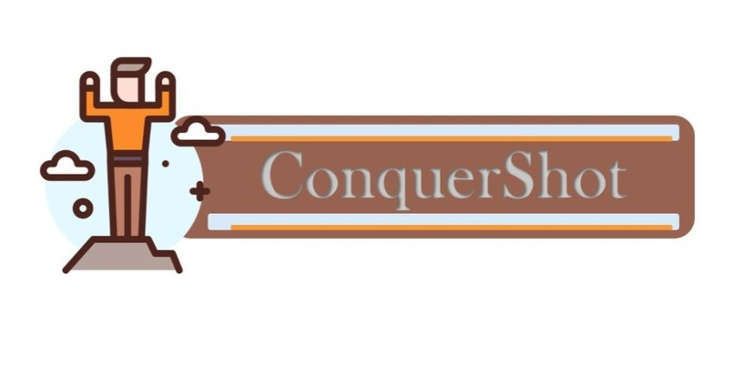
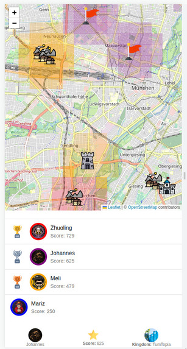
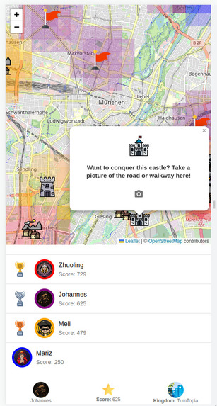

 # ConquerShot

Welcome to ConquerShot, an innovative application built with Python and React that combines the power of machine learning with a competitive game to improve digital earth reconstruction, particularly focusing on addressing issues in Open Street Map (OSM). This README provides an overview of the project structure, setup instructions, and key information.

## Project Overview

ConquerShot is a game where players contribute to fixing OSM issues by uploading pictures related to specific locations. The goal is to conquer territories and build empires in the real world while simultaneously improving the accuracy of OSM data. The application consists of a React frontend (located in the `/frontend` directory) and a Python backend (located in the `/backend` directory).

## Folder Structure

- `/frontend`: React frontend for the game built using React Leaflet to display OSM issues on an interactive map.
- `/backend`: Python backend with a machine learning pipeline, handling game logic and communication with the frontend.

## Project Setup

To set up the frontend and backend services, please refer to the individual README files in the `/frontend` and `/backend` directories.

## Contributors

This project was made possible through the collaborative efforts of the following individuals:

- [Mariz Samir Awad](https://github.com/marzi333)
- [Zhuoling Li](https://github.com/joelynli0110)
- [Melanie Maier](https://github.com/mmmaier)

## How We Built It

- **Frontend**: The game frontend is built using React with React Leaflet for interactive map display.
- **Backend**: The backend includes a machine learning pipeline with ResNet-18 models for image classification. The Flask application handles game logic and communication with the frontend.

## Challenges Faced

- Dealing with edge cases in the dataset for feature determination.
- Implementing a scoring algorithm for conquering territories.
- Creating a game world overlay on the OSM view with zoom and panning synchronization.

## Accomplishments

- Successfully trained a machine learning model with ~94.4% accuracy.
- Innovative territory display using an influence-based system on OSM tiles.
- Effective use of communication channels, such as Discord, for instant interaction with sponsors.

## Learning Experience

The project provided valuable learning opportunities in computer vision, image classification, React, Flask, and the Leaflet API.

## Screenshots

 | 